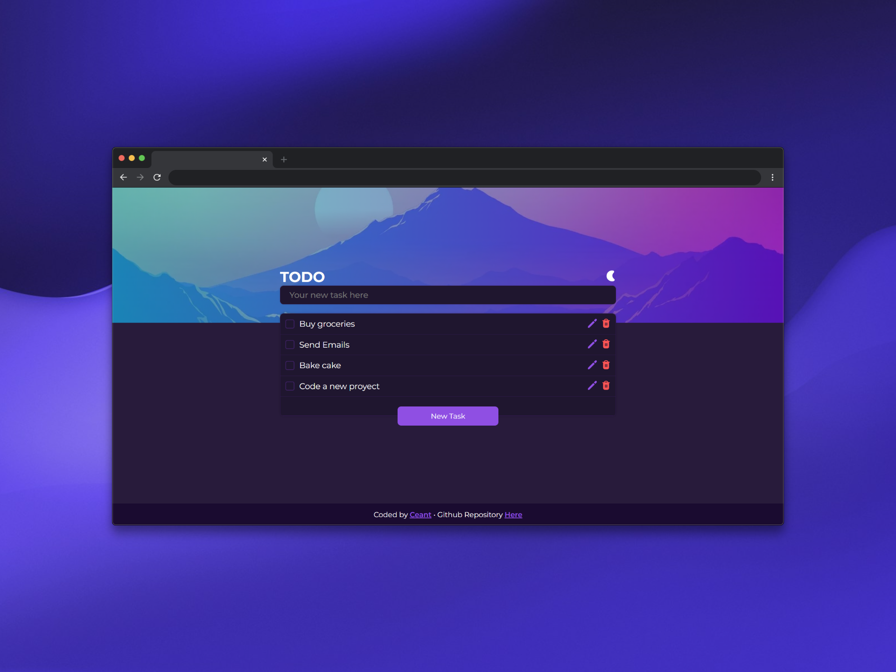
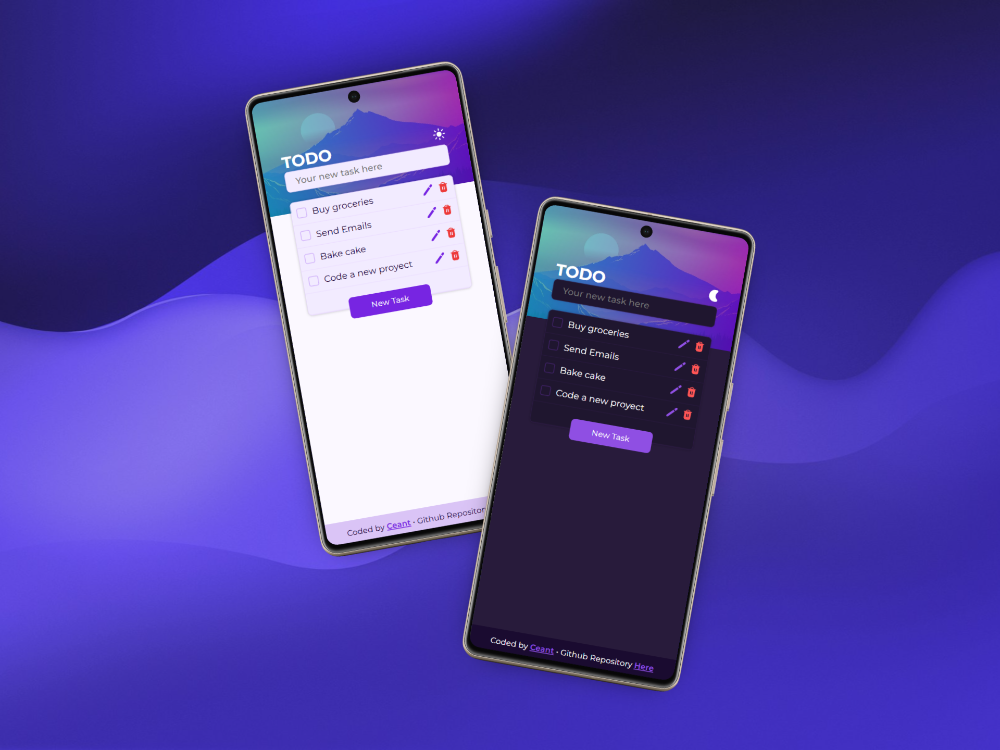

# To-Do List 📝

A fully functional To-Do List, built only with HTML, CSS, and JavaScript. Uses localStorage to save your tasks directly in your browser.

## 🌐 Project deploy

### [**https://theceant277.github.io/ToDo-List/**](https://theceant277.github.io/ToDo-List/)

## 📷 Screenshots

## 💾 Technologies

